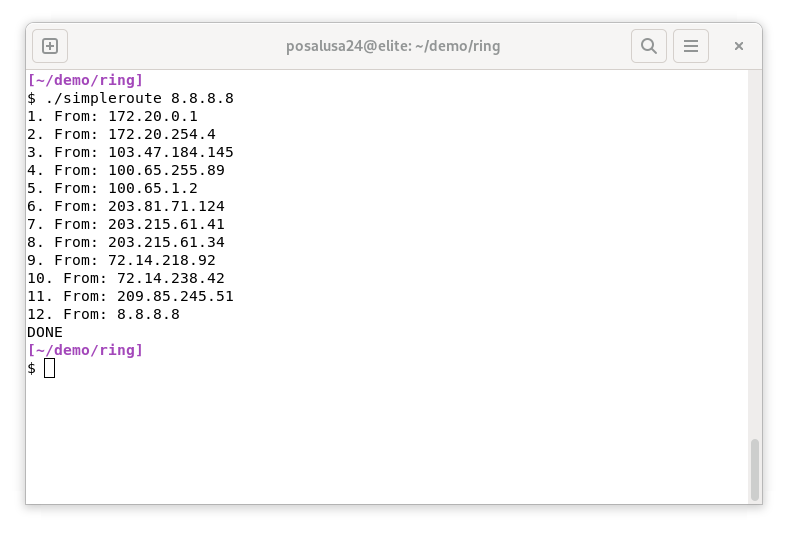
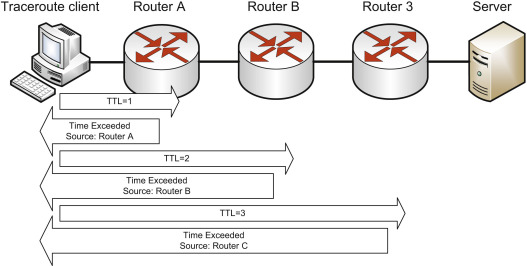
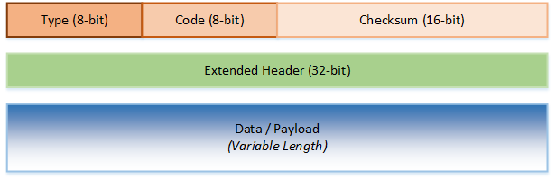
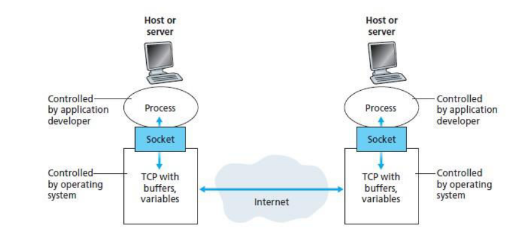
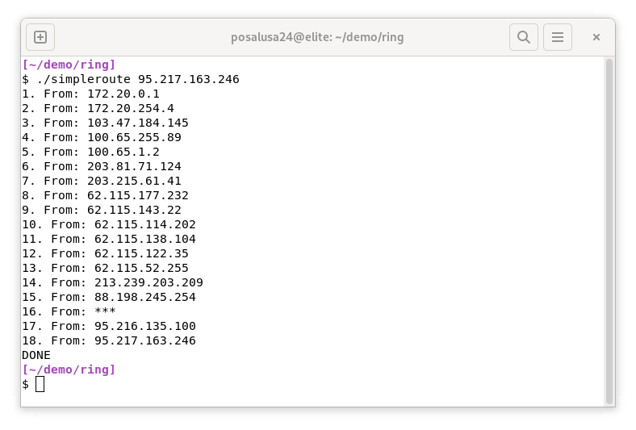
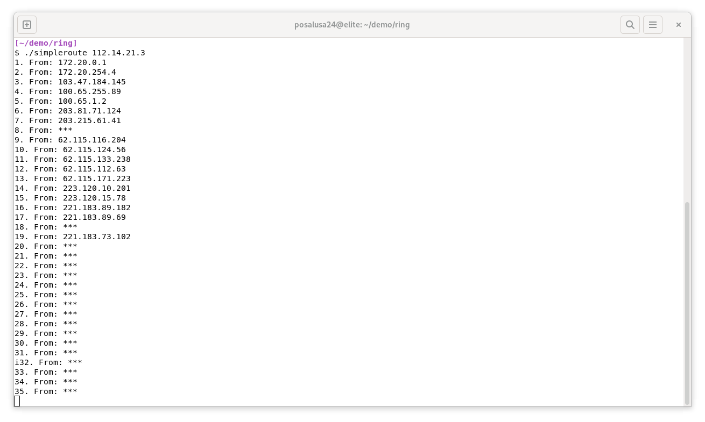

= Implementing traceroute in C using Linux sockets
Myint Myat Aung <myintmyataung@uit.edu.mm>
:source-highlighter: rouge
:rouge-style: github
:doctype: book
:toc:

== Overview

`traceroute` (also known as `tracert` on Windows) is a program that displays the route that network traffic takes through a network to reach a specific destination.
It is commonly used as a diagnostic tool to:

* Discover how traffic flows within an organization
* Determine the cause of a poor connection
* Pinpoint the location of a problematic network device

This paper describes a simple implementation of the `traceroute` utility in C, aptly named `simpleroute`.

`simpleroute` uses no external libraries; it relies on C standard library functions and Linux system calls to provide needed functionality.

.`simpleroute` in action

== Aims and objectives

The motivation behind `simpleroute` comes from 2 main goals:

* To showcase the effectiveness of network layer abstractions when writing programs.
* To highlight the cleverness of the original `traceroute`'s design.

In computer programming, abstractions allow programmers to ignore low-level details and think in terms of higher-level concepts when writing programs.
The network layers in a model such as the seven-layer OSI model abstract away unneeded information from other layers by encapsulation, e.g an IP packet encapsulated within a frame does not depend on the frame's details nor how it is transferred physically over a wire.

As such, to write an IP-based program like `simpleroute`, the programmer needs only to worry about IP-specific concepts like routing and TTLs, and can delegate lower-level tasks to library functions.
The Linux kernel provides the aforementioned abstraction over network layers in the form of network sockets.
This makes it trivial to develop otherwise complicated programs.

== Requirement analysis

`simpleroute` was developed using the following technologies:

* Operating system: Debian Linux
+
[quote]
For Linux system calls

* C Compiler: The GNU Compiler Collection (GCC)
+
[quote]
The C code uses GCC-specific functionality.

* Internet Standard: Internet Protocol (IP) Specification - RFC 791

* Internet Standard: Internet Control Message Protocol (ICMP) Specification - RFC 792

== Theory background + Experimental Setup

=== Uses of traceroute

Most implementations of `traceroute` also display how long it takes to reach each hop between the source and the destination.
This helps immensely in tracking down the root cause of 

=== The concept behind traceroute

The `traceroute` program exploits a fundamental property of IP routing, namely the time-to-live (TTL) property.
In a typical scenario, an IP packet reaches its destination by being forwarded along the network by routers.
To prevent packets from being routed in circles, the TTL field is decremented at every router.
Once the TTL reaches 0, the router discards the packet to prevent the packet from clogging up the network.
In addition, it also sends a 'Time Exceeded' message back to the source address signalling that the packet was not delivered successfully.

It is this message that `traceroute` uses to determine the route a packet takes.
By sending packets of gradually incrementing TTL fields towards a destination and recording successive 'Time Exceeded' replies of routers along the way, the path is traced out.

.Traceroute sends packets of gradually incrementing TTLs

=== ICMP packet header

`simpleroute` works by using IP packets to send ICMP messages.
ICMP is a supporting protocol in the Internet Protocol suite, used to send operational information and diagnostic messages.
ICMP differs from transport protocols such as TCP and UDP in that it is not typically used to exchange data.

Common tools that use ICMP include ping and traceroute among others.
`ping` uses ICMP's ECHO REQUEST and REPLY messages to check the connectivity of hosts.
`traceroute` takes this concept a step further by also responding to ICMP Time Exceeded requests from routers.

.An ICMP header

An ICMP packet consists of:

* A 1-byte ICMP packet type
* A 1-byte ICMP packet code, a further subcategory of type
* A 2-byte checksum calculated from the ICMP header and payload data, used for error checking.
* A 4-byte extended header, which includes information that depends on the ICMP packet type.
For an ECHO Request/Reply, this will consist of:
** A 2-byte identifier which can be used to identify who send the ICMP packet.
It is usually a process id.
** A 2-byte sequence number which is used to number packets sequentially.
* A variable-length payload.
On most ping/traceroute implementations on Linux, and in the case of `simpleroute`, the payload is a timestamp which represents the time the packet was sent.

The above information is encoded as a C struct in the code:

[,c]
----
struct icmp_packet {
  uint8_t type;
  uint8_t code;
  uint16_t checksum;
  uint16_t identifier;
  uint16_t seq_num;
  struct timeval timestamp;
};
----

`uint8_t` refers to an unsigned 8-bit integer, precisely the length of the type and code fields.
The checksum, identifier and seq_num fields are represented by a `uint16_t`, an unsigned 16-bit integer.

The last timestamp field is of type `struct timeval`.
This is a 32-bit (8-byte) structure that stores two 16-bit (long) values: `tv_sec` and `tv_usec`.

* `tv_sec` represents the time elapsed in seconds since the Unix Epoch, a common way of expressing time.
This can be translated later into a more human-readable format.
* `tv_usec` captures the rest of the elapsed time more precisely, in microseconds. <<man-timeval>>

==== ICMP Packet 

==== The issue of byte order

There can be a difference between the byte order of host systems and the byte order of data transmitted over the network.

Intel (x86) machines are little endian, which means the least significant bit is stored as the right most byte.
When data is trasmitted over a network, the network byte order is big endian, where the least significant bit is on the right.

.Big Endian vs Little Endian

This inconsistency can be solved in C using conversion functions under the header `<arpa/inet.h`.
The function `htons` is used to convert short (16-bit) integers from host byte order to network byte order, and the function `ntohs` does the opposite.
The function `htonl` is used to convert long (32-bit) integers from host byte order to network byte order, and the function `ntohl` does the opposite.

In `simpleroute`, ICMP checksum, identifier and sequence numbers (16-bit) fields are converted using `htons`, and the timestamp's `tv_sec` and `tv_usec` (32-bit) fields using `htonl` before building the ICMP packet.

[,c]
----
packet->identifier = htons(identifier_host_byte_order);
packet->seq_num = htons(seq_num_host_byte_order);
packet->timestamp.tv_sec = htonl(packet->timestamp.tv_sec);
packet->timestamp.tv_usec = htonl(packet->timestamp.tv_usec);
----

==== ICMP checksum calculation

The calculation for ICMP checksum is specified in RFC 1071 <<rfc-1071>> and is the same for IP, TCP and UDP.

. The checksum is calculated by treating all data as 16-bit words and adding them all together while recording carry outs.
. At the end of the checksum, all the accumulated carry outs are added back in.
. This is repeated once again to prevent another carry out.
. Then, the one's complement of the result is taken.
. The final result is the checksum. <<checksum>>

This algorithm can be expressed in C with bit-manipulation operators as:

[,c]
----
unsigned short icmp_packet_calc_checksum(void *b, int len) {
    unsigned short *buf = b;
    unsigned int sum = 0;
    unsigned short result;
 
    for (sum = 0; len > 1; len -= 2) {
        sum += *buf++;
    }

    if (len == 1) {
        sum += *(unsigned char*) buf;
    }

    sum = (sum >> 16) + (sum & 0xFFFF);
    sum += (sum >> 16);
    result = ~sum;
    return result;
}

----

=== Linux socket API

The Linux socket API is an interface provided by the linux kernel to facilitate communication between processes.

.How sockets work

==== Linux socket: Initialization

sockets are initiatied with the `socket` system call, where parameters can be provided to specify the type of socket required <<man-sockets>>:

* The first parameter is the *domain*.
This selects the protocol family which will be used for communication.
+
AF_INET, used for `simpleroute`, is the IPv4 protocol.

* The second parameter specifies the *communication semantics*, or the nature of communication.
Common values are `SOCK_STREAM` (for connection-based communication such as TCP) or `SOCK_DGRAM` (for connectionless communication such as UDP).
+
For `simpleroute`, we will use the SOCK_RAW type, which will provide raw network protocol access.
As we chose `AF_INET` as the domain, we can now work with raw IP packets.

* The last parameter specifies the protocol to be used with the socket.
Normally, there exists only one protocol for a particular socket type and the protocol need not be specified.
+
In our case, we shall only consider ICMP packets and thus, we use `IPPROTO_ICMP`.

.Socket initialization for `simpleroute`
[,c]
----
socket(AF_INET, SOCK_RAW, IPPROTO_ICMP);
----

The `socket` system call returns a file descriptor (`sockfd`) which can then be used to set socket options, transmit and receive data.

==== Linux socket: Options

Fields of the IP packet such as TTL can be set using the `setsockopt` system call.

.Setting TTL for `simpleroute`
[,c]
----
setsockopt(sockfd, IPPROTO_IP, IP_TTL, ttl_val, ...);
----

In this code, `IPPROTO_IP` and `IP_TTL` both specifiy that we want to set the TTL field of the IP packet to a certain value `ttl_val`.
`ttl_val` in our program will be gradually incremented as we want get the addresses of routers along the path.

.Setting a receive time out for `simpleroute`
[,c]
----
setsockopt(sockfd, SOL_SOCKET, SO_RCVTIMEO, (const char*) &tv_out, sizeof(tv_out));
----

This code above sets a receive timeout for IP packets.
This is required because some routers are configured specifically not to reply to ICMP ECHO requests.
This might be due to the ISP or organization not wanting to let users know about their network infrastructure and internal details.

If `simpleroute` does not receive a packet within a certain amount of time, three asterisks are displayed in the place of a router's IP address.

Combining everything above, we can create an ICMP Echo Request packet (ICMP type 8) with the following function:

[,c]
----
void icmp_packet_build_echo_req(struct icmp_packet *packet, uint16_t identifier_host_byte_order, uint16_t seq_num_host_byte_order) {
  memset(packet, 0, sizeof(*packet));
  packet->type = 8;
  packet->code = 0;
  packet->identifier = htons(identifier_host_byte_order);
  packet->seq_num = htons(seq_num_host_byte_order);
  gettimeofday(&packet->timestamp, NULL);
  packet->timestamp.tv_sec = htonl(packet->timestamp.tv_sec);
  packet->timestamp.tv_usec = htonl(packet->timestamp.tv_usec);

  packet->checksum = icmp_packet_calc_checksum(packet, sizeof(*packet));
}
----

==== Transmitting and receiving ICMP packets

Packets are transmitted using the `sendto` system call.
`sendto` takes as parameters the packet and an address to send it to.
The address is a `sockaddr_in` struct typecasted to a `sockaddr`.

.`sockaddr_in` struct fields
[,c]
----
struct sockaddr_in {
    short            sin_family;   // e.g AF_INET
    unsigned short   sin_port;     // only used for TCP/UDP packets
    struct in_addr   sin_addr;     // address structure
    char             sin_zero[8];  // unused
};
----

.`sendto` system call
[,c]
----
sendto(sockfd, &sent_packet, sizeof(sent_packet), 0, (struct sockaddr *) &dest_addr, dest_addr_len);
----

The packet is received using the `recvfrom` system call.
`recvfrom` stores the source address in a sockaddr passed by reference.

.`recvfrom` system call
[,c]
----
recvfrom(sockfd, &received_packet, sizeof(received_packet), 0, (struct sockaddr *) &src_addr, &src_addr_len);
----

=== Implementing the `traceroute` algorithm

To send IP packets of gradually incrementing TTLs (as described in <<The concept behind traceroute>>):

. TTL is set to 1, and
. An ICMP echo request is sent.
+
[quote]
The first router which decrements the TTL to 0 will reply with a 'Time Exceeded' message.
. The ICMP message is received and parsed.
.. If the ICMP message is a 'Time Exceeded' message, `simpleroute` prints the message's source address.
... Then, TTL is incremented by 1 and the whole process begins from Step 2.
.. If the ICMP message is a normal 'Echo reply' message, that means the destination IP has been reached.
`simpleroute` prints the IP address of this final destination and prints a 'DONE' indicating the successful completion of the program.

The above algorithm is expressed in C code as:

[,c]
----
for (int i = 0; i < 65536; i++) {
  icmp_packet_build_echo_req(&sent_packet, 12, 12);

  usleep(100000);

  if (sendto(sockfd, &sent_packet, sizeof(sent_packet), 0, (struct sockaddr *) &dest_addr, dest_addr_len) <= 0) {
    fprintf(stderr, "error\n");
    return -1;
  }

  memset(&received_packet, 0, sizeof(received_packet));

  int return_code;
  if (return_code = recvfrom(sockfd, &received_packet, sizeof(received_packet), 0, (struct sockaddr *) &src_addr, &src_addr_len) <= 0) {
    if (return_code == 1) {
      printf("%d. From: ***\n", ttl_val++);
      if (setsockopt(sockfd, IPPROTO_IP, IP_TTL, &ttl_val, sizeof(ttl_val)) != 0) {
        fprintf(stderr, "setsockopt error\n");
        return -1;
      }
      continue;
    }
    fprintf(stderr, "recvfrom error: %d\n", return_code);
    return -1;
  }

  printf("%d. From: %s\n", ttl_val++, inet_ntoa(src_addr.sin_addr));

  int reached = received_packet.payload_icmp.type == 0;
  if (reached) {
    printf("DONE\n");
    break;
  } else {
    if (setsockopt(sockfd, IPPROTO_IP, IP_TTL, &ttl_val, sizeof(ttl_val)) != 0) {
      fprintf(stderr, "setsockopt error\n");
      return -1;
    }
  }
}
----

=== Sample usage of `simpleroute`

* `simpleroute` is supplied with a single parameter indicating the destination address to trace a path to.

* Unresponsive hosts are indicated by `\***` and skipped.

* The routers along the path are listed in order of first encounter.

* `simpleroute` will try a maximum of 65536 hops to reach its destination. In the screenshot below, the reply packets eventually never reach the host computer and will be lost in the network (as indicated by asterisks towards the bottom).

=== Bonus features and extensions

* By calculating the time taken for a reply packet to be sent and displaying it alongside each address, we can also determine the *latency* of the connection to that particular address.

* The *ability to connect to a DNS server* can be added by creating a UDP socket and communicate according to the DNS specifications (RFCs 1034 and 1035).
This will allow `simpleroute` to also be able to ping friendly domain names (e.g www.google.com) instead of IP addresses.

== Conclusion

The complete 

<<<

[bibliography]
== References

* [[[man-timeval]]] timeval. Ubuntu Manpage. +
https://manpages.ubuntu.com/manpages/impish/man3/timeval.3bsd.html

* [[[man-sockets]]] socket. Linux manual page. +
https://man7.org/linux/man-pages/man2/socket.2.html

* [[[rfc-1071]]] RFC 1071 - Computing the Internet Checksum. +
http://www.faqs.org/rfcs/rfc1071.html

* [[[checksum]]] How to calculate checksum +
https://www.microchip.com/forums/m223760.aspx

* [[[ping-in-c]]] Ping in C +
https://www.geeksforgeeks.org/ping-in-c/
