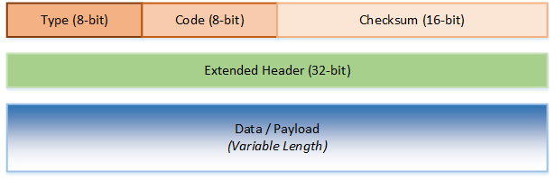

# simpleroute - a traceroute implementation in C using Linux sockets

## Overview

`traceroute` (also known as `tracert` on Windows) is a program that displays the route that network traffic takes through a network to reach a specific destination.
It is commonly used as a diagnostic tool to:

* Discover how traffic flows within an organization
* Determine the cause of a poor connection
* Pinpoint the location of a problematic network device

This paper describes a simple implementation of the `traceroute` utility in C, aptly named `simpletrace`.

`simpletrace` uses no external libraries; it relies on C standard library functions and Linux system calls to provide needed functionality.

## Aims

The motivation behind `simpleroute` comes from 2 main goals:

* To showcase the effectiveness of network layer abstractions when writing programs.
* To highlight the cleverness of the original `traceroute`'s design.

In computer programming, abstractions allow programmers to ignore low-level details and think in terms of higher-level concepts when writing programs.
The network layers in a model such as the seven-layer OSI model abstract away unneeded information from other layers by encapsulation, e.g an IP packet encapsulated within a frame does not depend on the frame's details nor how it is transferred physically over a wire.
As such, to write an IP-based program like `simpleroute`, the programmer needs only to worry about IP-specific concepts like routing and TTLs, and can delegate lower-level tasks to library functions.
The Linux kernel provides the aforementioned abstraction over network layers in the form of network sockets. This makes it trivial to develop otherwise complicated programs.

## Requirements analysis

`simpleroute` was developed using the following technologies:

* Operating system: Debian Linux

  > For Linux system calls

* C Compiler: The GNU Compiler Collection (GCC)

  > The C code uses GCC-specific functionality.

* Internet Standard: Internet Protocol (IP) Specification (RFC 791)

* Internet Standard: Internet Control Message Protocol (ICMP) Specification (RFC 792)

## traceroute concept overview

The `traceroute` program exploits a fundamental property of IP routing, namely the time-to-live (TTL) property.
In a typical scenario, an IP packet reaches its destination by being forwarded along the network by routers.
To prevent packets from being routed in circles, the TTL field is decremented at every router.
Once the TTL reaches 0, the router discards the packet to prevent the packet from clogging up the network.
In addition, it also sends a 'Time Exceeded' message back to the source address signalling that the packet was not delivered successfully.

It is this message that `traceroute` uses to determine the route a packet takes.
By sending packets of gradually incrementing TTL fields towards a destination and recording successive 'Time Exceeded' replies of routers along the way, the path is traced out.

## Program: ICMP parsing

`simpleroute` works by using IP packets to send ICMP messages.
ICMP is a supporting protocol in the Internet Protocol suite, used to send operational information and diagnostic messages.
ICMP differs from transport protocols such as TCP and UDP in that it is not typically used to exchange data. [Wikipedia][1]

Common tools that use ICMP include ping and traceroute among others.
`ping` uses ICMP's ECHO REQUEST and REPLY messages to check the connectivity of hosts.
`traceroute` takes this concept a step further by also responding to ICMP Time Exceeded requests from routers.

Fig 1. ICMP Header

An ICMP packet consists of
* A 1-byte ICMP packet type
* A 1-byte ICMP packet code, a further subcategory of type
* A 2-byte checksum calculated from the ICMP header and payload data, used for error checking.
* A 4-byte extended header, which includes information that depends on the ICMP packet type. For an ECHO Request/Reply, this will consist of:
  * A 2-byte identifier which can be used to identify who send the ICMP packet. It is usually a process id.
  * A 2-byte sequence number which is used to number packets sequentially.
* A variable-length payload. On most ping/traceroute implementations on Linux, and in the case of `simpleroute`, the payload is a timestamp which represents the time the packet was sent.

The above information is encoded as a C struct in the code:

